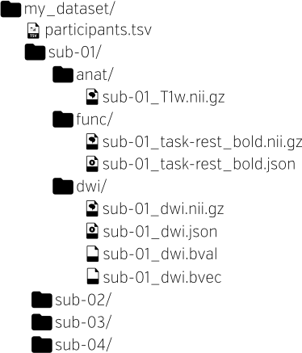

class: center middle

# fMRIPrep - A Robust Preprocessing Pipeline for Functional MRI
### CJ. Markiewicz, R. Ciric, O. Esteban
#### Center for Reproducible Neuroscience
#### Stanford University

###### [oesteban.github.io/fmriprep-demo](https://oesteban.github.io/fmriprep-demo)

---
name: footer
layout: true

<div class="slide-slug">Memory Lab - 05/24/2019</div>
---

.left-column[

# What is fMRIPrep?
]
.right-column[

## Robust, generic fMRI preprocessing
* Works with the data you give it, imposing minimal requirements
  * You can run it on a T1w scan and a BOLD series

## Standardized

* By adhering to modern data format standards, fMRIPrep can detect
  the available images and prepare outputs that can be used by all
  major software packages (FSL, SPM, etc.)

## Self-documenting

* fMRIPrep generates reports that allow you to detect issues in
  preprocessing

]

---

## Index

* General structure of the workflow
* Volumetric vs. surface analysis
* Why MRIQC and how they play along together?
* Tips and tricks for screening the visual reports
* Running fMRIPrep on Sherlock and other computing clusters and troubleshooting during installation

---

layout: true
template: footer

---

## General structure of the workflow

<div align="center" style='margin-top: 1em'>

</div>

---

## Anatomical processing: brain extraction, INU correction, brain tissue segmentation

<p>
<object class="svg-reportlet" type="image/svg+xml"
 data="assets/sub-001_T1w_seg_brainmask.svg">filename:assets/sub-001_T1w_seg_brainmask.svg</object>
</p>

The brain mask report shows the quality of intensity non-uniformity (INU) correction,
skull stripping, and tissue segmentation.

---

## Anatomical processing: spatial normalization

<p>
<object class="svg-reportlet" type="image/svg+xml"
 data="assets/sub-001_T1w_t1_2_mni.svg">filename:assets/sub-001_T1w_t1_2_mni.svg</object>
</p>

The MNI normalization report shows the quality of the non-linear normalization step.

Skull stripping defects may be more obvious here.

---

## Anatomical processing: surface reconstruction

<p>
<object class="svg-reportlet" type="image/svg+xml"
 data="assets/sub-001_T1w_reconall.svg">filename:assets/sub-001_T1w_reconall.svg</object>
</p>

The FreeSurfer subject reconstruction report shows the white-gray boundary
and pial surface overlaid on the T1w image.

---

## General structure of the workflow (recap)

<div align="center" style='margin-top: 1em'>

</div>

---

## Functional processing: susceptibility distortion correction

<p>
<object class="svg-reportlet" type="image/svg+xml"
 data="assets/sub-100185_task-machinegame_run-1_desc-sdc_bold.svg">filename:assets/sub-100185_task-machinegame_run-1_desc-sdc_bold.svg</object>
</p>

The fieldmap-less susceptibility distortion correction (SDC) report shows
a before and after view, with the white matter segmentation overlaid as
reference.

---

## Functional processing: SDC in detail

.left-column2[
* Hierarchy of SDC methods:
  1. PE-Polar
  2. Fieldmap
  3. Fieldmap-less


* Arguments:
  * ``--use-syn-sdc``
  * ``--force-syn``
  * ``--ignore fieldmaps``


* REQUIRES (opts. 1 or 2): setting the [``IntendedFor``](https://bids-specification.readthedocs.io/en/latest/04-modality-specific-files/01-magnetic-resonance-imaging-data.html#fieldmap-data) metadata field of fieldmaps.
]

.right-column2[
<p align="center">

</p>
]

---
## Functional processing: anatomical alignment

<p>
<object class="svg-reportlet" type="image/svg+xml"
 data="assets/sub-001_task-stroop_bold_bbr.svg">filename:assets/sub-001_task-stroop_bold_bbr.svg</object>
</p>

The boundary-based registration report shows the registered BOLD reference
with the white and pial surfaces overlaid.

---

## Functional processing: BOLD ROIs

<p>
<object class="svg-reportlet" type="image/svg+xml"
 data="assets/sub-100185_task-machinegame_run-1_desc-rois_bold.svg">filename:assets/sub-100185_task-machinegame_run-1_desc-rois_bold.svg</object>
</p>

BOLD ROI reports show the BOLD brainmask along with the aCompCor and
tCompCor masks.

---

## Functional processing: confounding signals (1)

<p align="center" style="padding-top: 120px;">

</p>

Variance explained w.r.t. number of components, with (a/t)CompCor denoising.

---

## Functional processing: confounding signals (2)

<p align="center">

</p>

The BOLD summary report shows several characteristic statistics along
with a carpetplot, giving a view of the temporal characteristics of the
preprocessed BOLD series.

---

## Functional processing: confounding signals (3)

<p align="center">

</p>

Correlations across regressors and their correlation to the global signal are also
presented since fMRIPrep 1.4.0.

---

## Surface outputs: "Grayordinates"

.left-column2[
<p align="center">

</p>
]

.right-column2[
* CIFTI2 files (``*_bold.dtseries.nii``) are built by sampling BOLD
  signal at ~92k locations across the gray matter.


* Combine surface and volumetric information.


* Enabled with the ``--cifti-outputs`` option


* However, fMRIPrep **only partially** supports the original grayordinates
  from the HCP project.


* Figure from ([Glasser et al., 2013](https://doi.org/10.1016/j.neuroimage.2013.04.127))
]

---

# MRIQC vs. fMRIPrep

.pull-left[

### MRIQC

* Purpose: assessment of *raw* MRI data
* Processing: quick & dirty
* Derivatives: image quality metrics only
* Reports: to assess the data
* Other outcomes: data exclusion list

#### Use first with pre-specified exclusion criteria
]

--

.pull-right[
### fMRIPrep

* Purpose: ready data for analysis
* Processing: careful & sophisticated
* Derivatives: BOLD data to feed models and contound regressors
* Reports: to assess the processing
* Other outcomes: boilerplate, etc.

#### Use after MRIQC, only on those subjects who passed QC
]

---

.left-column[
# fMRIPrep
### What is it?
### How do I use it?
]
.right-column[
## Brain Imaging Data Structure
* fMRIPrep will run on any BIDS-formatted dataset ([What is BIDS?](https://bids.neuroimaging.io))


### Docker
```Bash
$ pip install fmriprep-docker
$ fmriprep-docker /data_dir /outputs_dir participant
```

### Singularity
```Bash
$ singularity exec docker://poldracklab/fmriprep:latest \
  /data_dir /outputs_dir participant
```

### [OpenNeuro.org](https://openneuro.org/)

* OpenNeuro is a free, online platform for sharing and analyzing neuroimaging data
]


---

.small[
```Bash
#!/bin/bash
#
#SBATCH -J fmriprep
#SBATCH --array=1-13
#SBATCH --time=48:00:00
#SBATCH -n 1
#SBATCH --cpus-per-task=16
#SBATCH --mem-per-cpu=4G
#SBATCH -p russpold,owners,normal

# Outputs ----------------------------------
#SBATCH -o log/%x-%A-%a.out
#SBATCH -e log/%x-%A-%a.err
#SBATCH --mail-user=%u@stanford.edu
#SBATCH --mail-type=ALL
# ------------------------------------------

BIDS_DIR="$OAK/data/openfmri/ds000003"

export TEMPLATEFLOW_HOME="/oak/stanford/groups/russpold/data/templateflow"
SINGULARITY_CMD="singularity run -B $OAK:$OAK -B $L_SCRATCH:/work $GROUP_HOME/singularity_images/
poldracklab_fmriprep_1.4.0-2019-05-15-2870a0e4efbf.simg"
OUTPUT_DIR="${OAK}/data/openfmri/derivatives/ds000003/fmriprep-1.4.0"

unset PYTHONPATH
export FS_LICENSE=$HOME/.freesurfer.txt

subject=$( tail -n +2 $BIDS_DIR/participants.tsv | cut -f 1  | sed "${SLURM_ARRAY_TASK_ID}q;d" | sed "s/sub-//g" | \
           sed 's!.*/!!' )
cmd="${SINGULARITY_CMD} ${BIDS_DIR} ${OUTPUT_DIR} participant --participant-label $subject -w /work/ --use-aroma -vv \
    --skip_bids_validation --omp-nthreads 8 --nthreads 12 --mem_mb 30000 --use-syn-sdc --cifti-output --notrack \
    --output-spaces MNI152NLin2009cAsym:res-2 anat fsnative fsaverage5"
echo Running task ${SLURM_ARRAY_TASK_ID}
echo Commandline: $cmd
eval $cmd
exitcode=$?

if [ "$exitcode" -ne "0" ]; then
    echo "$subject" >> ${SLURM_JOB_NAME}_failed_subjects.${SLURM_ARRAY_JOB_ID}
    echo "${SLURM_ARRAY_TASK_ID}" >> ${SLURM_JOB_NAME}_failed_taskids.${SLURM_ARRAY_JOB_ID}
else
    echo "$subject" >> ${SLURM_JOB_NAME}_success_subjects.${SLURM_ARRAY_JOB_ID}
fi

echo Finished tasks ${SLURM_ARRAY_TASK_ID} with exit code $exitcode
exit $exitcode
```
]


---


### Requesting resources

```Bash
#!/bin/bash
#
#SBATCH -J fmriprep
#SBATCH --array=1-13%4
#SBATCH --time=48:00:00
#SBATCH -n 1
#SBATCH --cpus-per-task=16
#SBATCH --mem-per-cpu=4G
#SBATCH -p russpold,owners,normal

# Outputs ----------------------------------
#SBATCH -o log/%x-%A-%a.out
#SBATCH -e log/%x-%A-%a.err
#SBATCH --mail-user=%u@stanford.edu
#SBATCH --mail-type=ALL
# ------------------------------------------
```

Key line:

```Bash
#SBATCH --array=1-13%4
```

This will generate 13 parallel jobs, running maximum 4 simultaneously at any given time.
SLURM will generate variables ``${SLURM_ARRAY_TASK_ID}`` with integer values from 1 to 13
available in the scope of the sbatch script.


---

### Your data

.pull-left[]
.pull-right[
* BIDS datasets are organized by subject, modality, and image type.

* fMRIPrep uses T1-weighted images for anatomical preprocessing.

* BOLD series and field maps (if available) are used for
functional preprocessing.
]

---

### Derivatives

fMRIPrep outputs adhere to the
[BIDS Derivatives draft
specification](https://bids-specification.readthedocs.io/en/derivatives/05-derivatives/01-introduction.html).

.pull-left[

#### Anatomical

* T1-weighted template
  * INU-corrected
  * Multiple images merged
* Anatomical brain mask
* Tissue probability/class maps
  * Classes: GM, WM, CSF
* T1w ⇄ MNI transforms
* Reconstructed surfaces\*
  * `smoothwm`, `pial`, `midthickness`, `inflated`
* Parcellation and segmentation (`aparcaseg`)\*

.footnote[\* Requires FreeSurfer]

]

.pull-right[

#### Functional

In each output space (e.g., T1w, MNI, surface\*):

* Distortion corrected BOLD series
* BOLD mask
* Confounds (tabular file)
* Non-aggressively denoised BOLD series\*\*
* MELODIC mix (tabular file)\*\*
* ICA-AROMA noise components (tabular file)\*\*

.footnote[\*\* Requires ICA-AROMA]

]

---

layout: true
template: footer

## fMRIPrep walkthrough
### Reports

---

Reports describe the data as found, and the steps applied.

<p align="center">

</p>

Textual summaries are good to check for obvious failures, such as missing images or implausible
values.

---
name: funcsum

<p align="center">

</p>

The functional summary can vary based on:

1. Available data
---
template: funcsum
 \- SDC technique depends on the available field maps

---
template: funcsum
2. Metadata - slice-timing correction requires `SliceTiming` metadata entry

---
template: funcsum
2. Metadata
3. User selections - `bbregister` requires FreeSurfer, `FLIRT` used otherwise

---
template: funcsum
2. Metadata
3. User selections
4. Heuristics - BBR may fall back to volume-based coregistration

---

<div style="height: 3em"></div>

#### Summary

1. Show researchers their data
2. Describe the preprocessing performed
3. Show the results of preprocessing, facilitating early error detection

---

layout: true
template: footer

.left-column[

# fMRIPrep
### What is it?
### How do I use it?
### Walk-through
### But what about...

]

---
.right-column[## fMRIPrep is stable, not finished!]
--
.right-column[
* fMRI preprocessing is a moving target, and best practices are going to change.
]
--
.right-column[
* You may already have improvements you want to make.
]
--
.right-column[
* fMRIPrep is a community-supported effort, and your contributions are encouraged!
]

---

.right-column[

## Collaborative infrastructure

fMRIPrep is hosted on [GitHub](https://github.com/poldracklab/fmriprep), a version
control platform with built-in support for discussions and code reviews.

#### Issues

Users can contribute issues to flag bugs, request features, or note gaps in our
documentation.


]

---

.right-column[

## Collaborative infrastructure
#### Pull requests

Users can directly contribute bug fixes, new features, and documentation updates.


]

---

.right-column[

## Outside contributions

Significant components of current fMRIPrep functionality were contributed by
interested users who had needs we didn't yet support.

Large additions include:

* ICA-AROMA support ([@jdkent](https://github.com/jdkent))
* Multi-echo BOLD ([@emdupre](https://github.com/emdupre))
* CIFTI2 outputs ([@mgxd](https://github.com/mgxd))
* Lesion masking ([@danlurie](https://github.com/danlurie))

In addition, we've had numerous bug fixes and documentation updates from users.


]
---
.right-column[
## Citations Needed

We believe that code and documentation are academic and scientific
contributions that deserve citation.


Zenodo is an online repository that archives and assigns DOIs to software.
We encourage all contributors to add themselves to our author list.

]

---

.right-column[

## Collaborative infrastructure (reprise)
#### Neurostars

We also participate in the Neurostars community, to make user support more
accessible and searchable.


]

---

layout: true
template: footer

---

## Summary

fMRIPrep is a **robust**, **generic** fMRI preprocessing pipeline that produces
outputs that are ready to be used in various analysis pipelines\*.

--

Generated reports enable researchers to quickly identify issues in their data
as well as any errors in preprocessing.

--

fMRIPrep is a **community effort**. We welcome *any* level of engagement, from
reporting bugs to contributing code.

---

## Live links

* [OpenNeuro.org](https://openneuro.org)
  * [DS000001](https://openneuro.org/datasets/ds000001/versions/00006?app=FMRIPREP&version=58&job=5af461051841f62a9a80d70d)
  * [DS000233](https://openneuro.org/datasets/ds000233/versions/00004?app=FMRIPREP&version=57&job=5aea16e089704e1298dbd618)

---

## "Live" links

* [sub-01](assets/sub-01.html)
* [sub-rid000001](assets/sub-rid000001.html)
