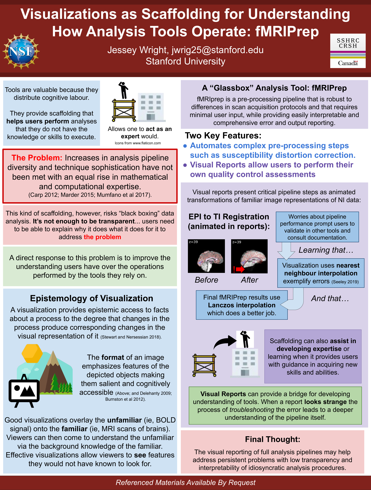

name: sidebar
layout: true

.perma-sidebar[
##Th587
# fMRIPrep


<div class="sidebar-slug"></div>
]

---

class: center middle

# fMRIPrep - A Robust Preprocessing Pipeline for Functional MRI
### O. Esteban, R. Ciric, CJ. Markiewicz, RA. Poldrack, and KJ. Gorgolewski
#### Center for Reproducible Neuroscience
#### Stanford University

###### [oesteban.github.io/ohbm19](https://oesteban.github.io/ohbm19)

---

<p align="center">
  
</p>

---

layout: true
template: sidebar

---

## Robust, generic fMRI preprocessing
* Adapts the workflow to the actual data available
  * fMRIPrep can detect the available images and prepare outputs that can be used by all
  major software packages (FSL, SPM\*, etc.)

* Imposing minimal requirements:
  * At least one T1w and one BOLD run
  * Data must be [BIDS-Compliant](https://bids-standard.github.io/bids-validator/)

## Adhered to modern standards and community-driven

* fMRIPrep is a [BIDS-App](https://bids-apps.github.io)


## Self-documenting

* fMRIPrep generates reports that allow you to detect issues in
  preprocessing


.footnote[\* Output NIfTI files are compressed, which can be pretty inconvenient for SPM users.]

---

## Reports as Scaffolds for Expertise

.pull-left[
<p align="center">

</p>
]

.pull-right[

.distribute[
fMRIPrep generates one participant-wide report
after execution, providing .blue[visual support to look inside the box].

.large[Reports are a crucial element to ensure transparency.]

.blue[Check out poster W633 by J. Wright!]
]
]


---

## fMRIPrep Reports

.pull-left[
Reports describe the data as found, and the steps applied:

  1. Show researchers their data

  2. Describe the preprocessing performed

  3. Show the results of preprocessing, facilitating early error detection

]

.pull-right[
<p align="center">

</p>
Textual summaries are good to check for obvious failures, such as missing images or implausible
values.
]


---

## fMRIPrep Reports: functional summary

.pull-right[
<p align="center">

</p>
]

.pull-left[
The functional summary can vary based on:

1. Available data
 \- SDC technique depends on the available field maps

2. Metadata - slice-timing correction requires `SliceTiming` metadata entry

3. User selections - `bbregister` requires FreeSurfer, `FLIRT` used otherwise

4. Heuristics - BBR may fall back to volume-based coregistration
]

---
## General structure of the workflow

<div align="center" style='margin-top: 1em'>

</div>

---

## Anatomical processing: brain extraction, INU correction, brain tissue segmentation

<div style='margin-top: 1em'>

</div>

The brain mask report shows the quality of intensity non-uniformity (INU) correction,
skull stripping, and tissue segmentation.

---

## Anatomical processing: spatial normalization

<div style='margin-top: 1em'>
<object class="svg-reportlet" type="image/svg+xml"
 data="assets/sub-001_T1w_t1_2_mni.svg">filename:assets/sub-001_T1w_t1_2_mni.svg</object>
</div>

The spatial normalization report shows the quality of the non-linear alignment to one or several
neuroimaging templates.

Skull stripping defects may be more obvious here.

---


<p align="center">
  
</p>
Poster W571

---

## Spatial normalization to pediatric template (as of v. 1.4.1rc4)

<div style='margin-top: 1em'>
<object class="svg-reportlet" type="image/svg+xml"
 data="assets/sub-NDARINV3BL9Z315_space-MNIPediatricAsym_T1w.svg">filename:assets/sub-001_T1w_t1_2_mni.svg</object>
</div>


Starting with version 1.4.1rc4 (which will become 1.4.1), fMRIPrep allows spatial normalization to one
or more standardized spatial references - including infant and pediatric templates.

Target templates can be specified with the `--output-spaces` command line argument.

---

## Anatomical processing: surface reconstruction

<p>
<object class="svg-reportlet" type="image/svg+xml"
 data="assets/sub-001_T1w_reconall.svg">filename:assets/sub-001_T1w_reconall.svg</object>
</p>

The FreeSurfer subject reconstruction report shows the white-gray boundary
and pial surface overlaid on the T1w image.

---

## General structure of the workflow (recap)

<div align="center" style='margin-top: 1em'>

</div>

---

## Functional processing: susceptibility distortion correction

<p>
<object class="svg-reportlet" type="image/svg+xml"
 data="assets/sub-100185_task-machinegame_run-1_desc-sdc_bold.svg">filename:assets/sub-100185_task-machinegame_run-1_desc-sdc_bold.svg</object>
</p>

The susceptibility distortion correction (SDC) report shows
a before (correction) and after view, with the white matter segmentation overlaid for
reference.

---

## Functional processing: SDC in detail


.left-column3[
<p align="center">

</p>
]

.right-column3[
* Hierarchy of SDC methods:
  1. PE-Polar
  2. Fieldmap
  3. Fieldmap-less


* Arguments:
  * `--use-syn-sdc`
  * `--force-syn`
  * `--ignore fieldmaps`


* REQUIRES (opts. 1 or 2): setting the [`IntendedFor`](https://bids-specification.readthedocs.io/en/latest/04-modality-specific-files/01-magnetic-resonance-imaging-data.html#fieldmap-data) metadata field of fieldmaps.
]

---
## Functional processing: anatomical alignment

<p>
<object class="svg-reportlet" type="image/svg+xml"
 data="assets/sub-001_task-stroop_bold_bbr.svg">filename:assets/sub-001_task-stroop_bold_bbr.svg</object>
</p>

The boundary-based registration report shows the registered BOLD reference
with the white and pial surfaces overlaid.

---

## Functional processing: BOLD ROIs

<p>
<object class="svg-reportlet" type="image/svg+xml"
 data="assets/sub-100185_task-machinegame_run-1_desc-rois_bold.svg">filename:assets/sub-100185_task-machinegame_run-1_desc-rois_bold.svg</object>
</p>

BOLD ROI reports show the BOLD brainmask along with the aCompCor and
tCompCor masks.

---

## Functional processing: confounding signals (1)

<p align="center" style="padding-top: 120px;">

</p>

Variance explained w.r.t. number of components, with (a/t)CompCor denoising.

---

## Functional processing: confounding signals (2)

<p align="center">

</p>

The BOLD summary report shows several characteristic statistics along
with a carpetplot ([Power, 2016](https://doi.org/10.1016/j.neuroimage.2016.08.009)), giving a view of the temporal characteristics of the
preprocessed BOLD series.

---

## Functional processing: confounding signals (3)

<p align="center">

</p>

Correlations across regressors and their correlation to the global signal are also
presented since fMRIPrep 1.4.0.

---

## Surface outputs: "Grayordinates"

.left-column[
<p align="center">

</p>
]

.right-column[

* CIFTI2 files (`_bold.dtseries.nii`) are built by sampling BOLD
  signal at 92k locations across the gray matter.

* Combine surface and volumetric information.

* Enabled with the `--cifti-outputs` option

* However, fMRIPrep **only partially** supports the original grayordinates
  from the HCP project.

* Figure from ([Glasser et al., 2013](https://doi.org/10.1016/j.neuroimage.2013.04.127))

]


---

## Outputs are BIDS-Derivatives

fMRIPrep outputs adhere to the
[BIDS Derivatives draft
specification](https://bids-specification.readthedocs.io/en/derivatives/05-derivatives/01-introduction.html).

.pull-left[

#### Anatomical

* T1-weighted template
  * INU-corrected
  * Multiple images merged
* Anatomical brain mask
* Tissue probability/class maps
  * Classes: GM, WM, CSF
* T1w ⇄ Normalized space transforms
* Reconstructed surfaces\*
  * `smoothwm`, `pial`, `midthickness`, `inflated`
* Parcellation and segmentation (`aparcaseg`)\*

.footnote[\* Requires FreeSurfer]

]

.pull-right[

#### Functional

In each output space (e.g., T1w, normalized spaces, surface\*):

* Distortion corrected BOLD series
* BOLD mask
* Confounds (tabular file)
* Non-aggressively denoised BOLD series\*\*
* MELODIC mix (tabular file)\*\*
* ICA-AROMA noise components (tabular file)\*\*

.footnote[\*\* Requires ICA-AROMA]

]

---

## MRIQC vs. fMRIPrep

.pull-left[

### MRIQC

* Purpose: assessment of *raw* MRI data

* Processing: quick & dirty

* Derivatives: image quality metrics only

* Reports: to assess the data

* Other outcomes: data exclusion list

.blue[Use first with pre-specified exclusion criteria]

]

--

.pull-right[
### fMRIPrep

* Purpose: ready data for analysis

* Processing: careful & sophisticated

* Derivatives: BOLD data to feed models and contound regressors

* Reports: to assess the processing

* Other outcomes: boilerplate, etc.

.blue[Use after MRIQC, only on those subjects who passed QC]
]

---

### Tips and tricks: pre-run FreeSurfer

Either if you have already run FreeSurfer (+6.0.0), or you are just running the dataset
for first, you can feed FreeSurfer outputs into fMRIPrep.

* Pre-run FreeSurfer - make sure the folder is available under the output folder:
  .small[
  ```Text
├── derivatives
│   ├── fmriprep-1.4.0
│   │   └── freesurfer ───────┐
  │   ├── freesurfer-6.0.1  <───┘
  ```
  ]
  .small[
  ```Bash
$ mkdir -p derivatives/fmriprep-1.4.0
  $ cd derivatives/fmriprep-1.4.0
  $ ln -s ../freesurfer-6.0.1 freesurfer
  ```
  ]

  * Delete previously existing `IsRunning` files:
  .small[
  ```Bash
$ find ${BIDS_DIR}/derivatives/freesurfer-6.0.1 -name "*IsRunning*" -delete

  ```
  ]

* If not pre-run, make a first pass with the flag `--anat-only`.
  .small[
  ```Bash
$ mkdir -p derivatives/fmriprep-1.4.0
  $ mkdir -p derivatives/freesurfer-6.0.1
  $ cd derivatives/fmriprep-1.4.0
  $ ln -s ../freesurfer-6.0.1 freesurfer
  ```
  ]
---
## fMRIPrep is stable, not finished!
--

* fMRI preprocessing is a moving target, and best practices are going to change.

--

* You may already have improvements you want to make.

--

* fMRIPrep is a community-supported effort, and your contributions are encouraged!


---

## Collaborative infrastructure

fMRIPrep is hosted on [GitHub](https://github.com/poldracklab/fmriprep), a version
control platform with built-in support for discussions and code reviews.

#### Issues

Users can contribute issues to flag bugs, request features, or note gaps in our
documentation.


---

## Collaborative infrastructure
#### Pull requests

Users can directly contribute bug fixes, new features, and documentation updates.


---

## Outside contributions

Significant components of current fMRIPrep functionality were contributed by
interested users who had needs we didn't yet support.

Large additions include:

* ICA-AROMA support ([@jdkent](https://github.com/jdkent))
* Multi-echo BOLD ([@emdupre](https://github.com/emdupre))
* CIFTI2 outputs ([@mgxd](https://github.com/mgxd))
* Lesion masking ([@danlurie](https://github.com/danlurie))

In addition, we've had numerous bug fixes and documentation updates from users.


---

## Citations Needed

We believe that code and documentation are academic and scientific
contributions that deserve citation.

<p align="center">

</p>

---

## Collaborative infrastructure (reprise)
#### Neurostars

We also participate in the Neurostars community, to make user support more
accessible and searchable.


---

## Summary

fMRIPrep is a **robust**, **generic** fMRI preprocessing pipeline that produces
outputs that are ready to be used in various analysis pipelines\*.

--

Generated reports enable researchers to quickly identify issues in their data
as well as any errors in preprocessing.

--

fMRIPrep is a **community effort**. We welcome *any* level of engagement, from
reporting bugs to contributing code.

---

## Live links

* [OpenNeuro.org](https://openneuro.org)
  * [DS000001](https://openneuro.org/datasets/ds000001/versions/00006?app=FMRIPREP&version=58&job=5af461051841f62a9a80d70d)
  * [DS000233](https://openneuro.org/datasets/ds000233/versions/00004?app=FMRIPREP&version=57&job=5aea16e089704e1298dbd618)

---

## "Live" links

* [sub-01](assets/sub-01.html)
* [sub-rid000001](assets/sub-rid000001.html)
ci